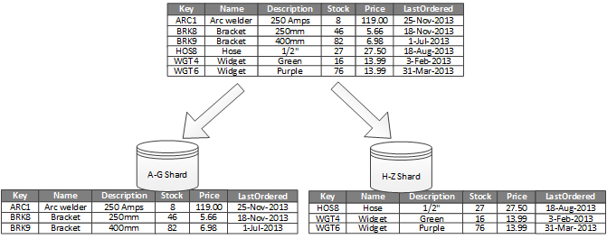

# Vertical scaling. 
- Its limits are determined by the maximun capacity of indiviual servers. 
- May required costly hardware upgrades or replacements, loading to disruptions. 

## Database partitioning.
Consequences of partitioning. 
- Loosing Data: better do a backup of data before doing the partioning.
- Pipeline errors.
### Vertical
- Split data in tables with less columns. 

### Horizontal partitioning (Sharding)
- Spit data in different tables.
