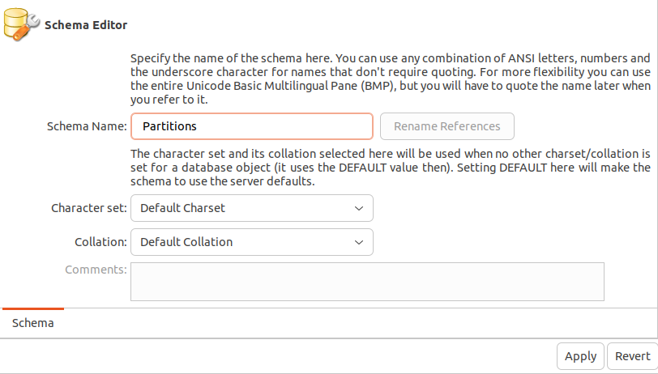

# Database partition

## Running steps
1. Run the docker-compose file 
```bash
cd /practicas/01-Database_Partitioning/docker
docker-compose up -d
```

2. Connect to the database:
- Host: 0.0.0.0 
- Port: 3306
- User: root
- Password: password

For this practice was used Mysql Workbench

3. Choose a schema on the database, for this case a new schema was created


4. On the slected schema run the `.sql` files. Below is an explanation of each file.

## SQL files explanations
### Hash_partition.sql
Hash partition ensures an even distribution among a predetermined number of partitions. It is necessary to specify the column value to make the hash. 

1. Creates a table `sales` with four partitions using the hash approach with the id.

```sql
DROP TABLE IF EXISTS sales;

CREATE TABLE sales (
	id INT AUTO_INCREMENT PRIMARY KEY,
    sale_date DATE,
    amount DECIMAL(10, 2)
) 
PARTITION BY HASH (id)
PARTITIONS 4;
```

2. Inserts data into sales table. 

```sql
INSERT INTO sales (sale_date, amount) VALUES
('2024-01-01', 100.00),
('2024-01-02', 150.50),
('2024-01-03', 200.25),
('2024-01-04', 175.75),
... 
```

3. You can use the selects to view data of all table, or to view data in each partition
```sql
SELECT * FROM sales;

SELECT * FROM sales PARTITION (p0); 
SELECT * FROM sales PARTITION (p1); 
SELECT * FROM sales PARTITION (p2); 
SELECT * FROM sales PARTITION (p3); 
```

### Key_partitions.sql
Partition by key is similar to hash, but automatically uses the primary key. 

1. Creates a `sales` table. With four partitions, by key. 

```sql
DROP TABLE IF EXISTS sales;

CREATE TABLE sales (
	id INT AUTO_INCREMENT PRIMARY KEY,
    sale_date DATE,
    amount DECIMAL(10, 2)
) 
PARTITION BY KEY()
PARTITIONS 4;

```

2. Adds data to sql files
```sql
INSERT INTO sales (sale_date, amount) VALUES
('2024-01-01', 100.00),
('2024-01-02', 150.50),
('2024-01-03', 200.25),
...
```

3. Use the selects to view data on each partition. 

```sql
SELECT * FROM sales;

SELECT * FROM sales PARTITION (p0); 
SELECT * FROM sales PARTITION (p1); 
SELECT * FROM sales PARTITION (p2); 
SELECT * FROM sales PARTITION (p3); 
```

### Range_partition.sql
Its partition values are defined by a given range. 

1. Creates a `books` table with five partitions with defined range. 

```sql
CREATE TABLE books (
	id INT NOT NULL, 
    title VARCHAR(30), 
    author VARCHAR(30),
    created DATE NOT NULL DEFAULT '1970-01-01',
    UNIQUE KEY(id)
)
PARTITION BY RANGE (id) (
    PARTITION p0 VALUES LESS THAN (200),
    PARTITION p1 VALUES LESS THAN (400),
    PARTITION p2 VALUES LESS THAN (600),
    PARTITION p3 VALUES LESS THAN (800),
    PARTITION p4 VALUES LESS THAN (1000), 
    PARTITION p5 VALUES LESS THAN MAXVALUE
);
```

2. Inserts data into the books table 
```sql
INSERT INTO books (id, title, author, created)
VALUES 
    (100, 'Book1', 'Author1', '2024-05-15'),
    (150, 'Book2', 'Author2', '2024-05-15'),
    (250, 'Book3', 'Author3', '2024-05-15'),
    ... 
```

3. Use the selects to view data partitioned by the given range.
```sql 
SELECT * FROM books PARTITION (p0);
SELECT * FROM books PARTITION (p1);
SELECT * FROM books PARTITION (p2);
SELECT * FROM books PARTITION (p3);
SELECT * FROM books PARTITION (p4);
SELECT * FROM books PARTITION (p5);
```

### List_partition.sql
Similar to range partition, but uses given values instead of ranges. 

1. Creates a sales table, with a partition by list. Each partition will contain sale stored in each month. 
```sql
CREATE TABLE sales (
    sale_date DATE,
    amount DECIMAL(10, 2)
) 
PARTITION BY LIST (MONTH(sale_date)) (
    PARTITION p_january VALUES IN (1),
    PARTITION p_february VALUES IN (2),
    PARTITION p_march VALUES IN (3),
    PARTITION p_april VALUES IN (4),
    PARTITION p_may VALUES IN (5),
    PARTITION p_june VALUES IN (6),
    PARTITION p_july VALUES IN (7),
    PARTITION p_august VALUES IN (8),
    PARTITION p_september VALUES IN (9),
    PARTITION p_october VALUES IN (10),
    PARTITION p_november VALUES IN (11),
    PARTITION p_december VALUES IN (12)
);
```

2. Add data to the table
```sql
INSERT INTO sales (sale_date, amount) VALUES
('2024-01-01', 100.00),
('2024-01-02', 150.50),
('2024-01-03', 200.25),
...  
```

3. Use the select to view data in each partition

```sql 
SELECT * FROM sales PARTITION (p_january);
SELECT * FROM sales PARTITION (p_february);
SELECT * FROM sales PARTITION (p_december);
```