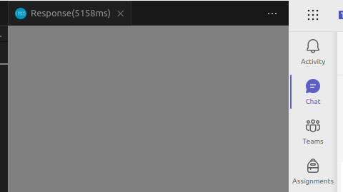

# 03 - Exploring noSQL 
You need node to run this environment

Steps:
### 1. Start the mongo db container 
`docker-compose up -d`

### 2. Populate the database.
 `node populate_data.js`

This may a while on run. 

### 3. Start the express server
```
cd posts-mongo
npm i
npm start
``` 

### 4. Make requests and check the running time
- Open the `posts-mongo/http_tests/user.http` and make the get request.


- We can see that the request takes a little time, and it is too big, that it cannot show the response. 

- Also, We saw in class that making a like post takes a lot of time when there are too much posts.


### Trying to improve performance
- The idea was to add a user a param likes: 
```json
user {
    likes: [ObjetId.post]
}
```

- This way the performance of adding likes would improve, so instead of: 
```js
    let post = await Post.findById(postId);
    if (!post) {
        return res.status(404).send({ error: 'Post not found' });
    }

    const likeIndex = post.likes.findIndex(like => like.userId.toString() === userId);
    if (likeIndex === -1) {
        // Add like if not already liked
        post.likes.push({ userId });
    } else {
        // Remove like if already liked
        post.likes.splice(likeIndex, 1);
    }
```

would be:
```js
    let user = await User.findById(userId); 
    if (!user){
        return res.status(404).send({ error: 'User not found' });
    }

    const post = user.likes.findIndex(like => like.postId.toString() === postId)
```

I thought this may improve a the performance, because: 
- A user can do n posts, so there will allways be more posts than users. 

But then I realized is not that good becuase: 
- You would the likes array on the posts, otherwise getting the likes of a post would be complicated- 
- The more likes a user gives to a post, the more the like arrays grows, so at the end is not that good. 


